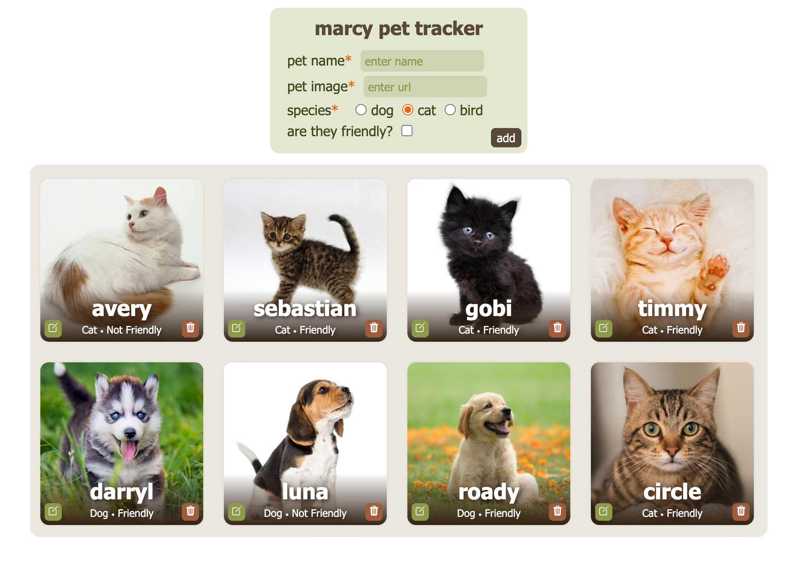
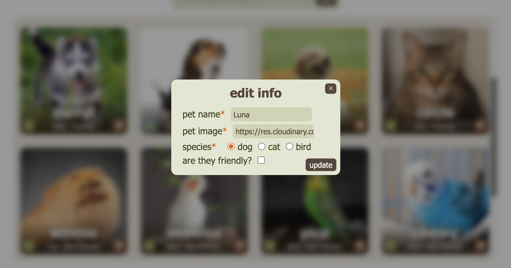
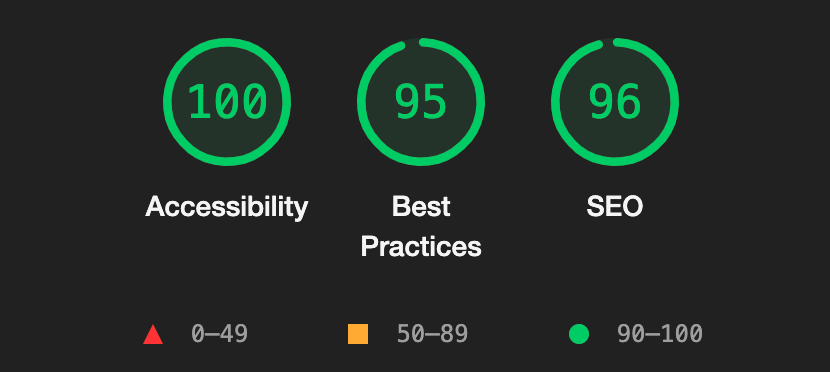
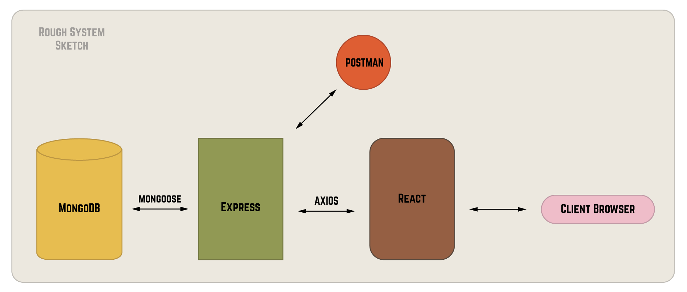

# Marcy Pet Tracker





## Overview

This project was made as part of Marcy Lab School's Lead Instructor interview process. This is a simple CRUD app that helps you keep track of your pets. This app aheres to the following [requirements](https://github.com/The-Marcy-Lab-School/lead-instructor-take-home-challenge). **Tech Stack:** JavaScript, React, Express, Node.js, and MongoDB.

### Step 1: Clone the repository

```bash
git clone https://github.com/madhurxyz/marcy-pet-tracker.git
```

### Step 2: Open two terminal windows & navigate to the following directories

```bash
cd marcy-pet-tracker/frontend
cd marcy-pet-tracker/server
```

### Step 3: Start both apps accordingly

server:
```bash
npm run dev
```

frontend:
```bash
npm start
```

### Step 4: Open the app on your local environment

server:
```bash
http://localhost:3001/api/pets
```

frontend:
```bash
http://localhost:3000
```

### Areas I'd work on if I had more time
• Improving the React app to have robust component structure
• Overall nomenclature revamp
• Making a global state store for easier access to state